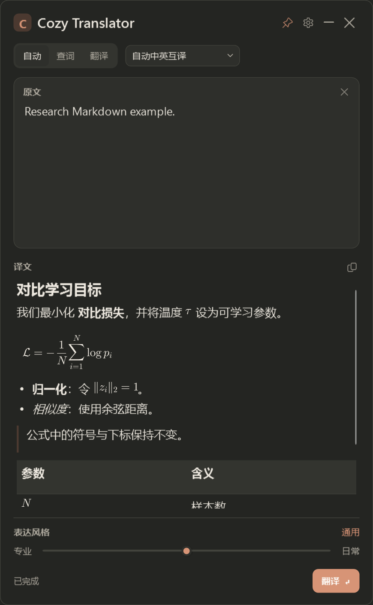

# CozyTranslator

[English](README.md) | **简体中文**

一款轻量化的 Windows LLM 翻译与查词工具，支持用户配置自己的api key，兼容各家模型。

## 公测版

[下载 v0.3.0-beta.2](https://github.com/PistilReaper/CozyTranslator/releases/tag/v0.3.0-beta.2) · [反馈问题](https://github.com/PistilReaper/CozyTranslator/issues) · [MIT 许可证](LICENSE)



## 开始使用

1. 解压 `CozyTranslator-v0.3.0-beta.2-win-x64.zip` 到固定目录。
2. 运行其中的 `CozyTranslator.exe`。请保留同目录内的运行时文件。
3. 点击齿轮或“配置模型”，选择协议，填写基础地址、准确的模型名称和 API Key。
4. 可点“测试连接”发送一句简短的测试文本，成功后保存。
5. 在设置的“翻译触发”中选择复制即翻译、右键模式或仅手动。也可直接输入，按 `Ctrl+Enter` 提交。
6. 在设置中选择主题和字号（16–24）；外观设置可在配置 API 前保存。

自包含发行包包含 .NET 10 运行时，使用时无需安装 SDK 或桌面运行时。目标为 Windows x64，已在本机 Windows 11 24H2 验证。

当前应用界面为简体中文。

从旧版更新时，先在旧版托盘菜单中选择“退出”，再解压运行新版。原来的 API Key、模型和提示词会从同一本地设置目录读取，无需重填。

## 翻译触发

- **模式 1 · 复制即翻译**：在其他程序复制文字，自动填入原文并翻译。
- **模式 2 · 右键模式**：按住左键选中一句话、一段文字或单词，**左键不松开，再用中指点右键**；选词查词，句段翻译。触发时将选中的原文复制到剪贴板，普通右键菜单保留，原文窗口保持焦点。
- **仅手动**：直接输入后按 `Ctrl+Enter`，或通过悬浮球/全局快捷键查询剪贴板。

设置与托盘菜单都可切换。右键模式向原应用发送 Ctrl+C，只翻译该应用本次复制产生的新文本，无需 UI Automation 选区接口。已在 Chrome 152 和 360 极速 X 22.3 验证选词及选句。原文须能正常复制；扫描图片、禁止复制的内容、高权限窗口或被拦截的快捷键不保证支持。复制失败时不会翻译剪贴板中的旧内容。

## 两种阅读方式

- **句段翻译**：上下对照；默认自动中英互译，可明确指定方向；译文流式显示。
- **英文查词**：单个英文词自动显示词性、常见中文释义、英美音标及本地朗读按钮。连字符、词内撇号和外围标点受到支持。
- **模式切换**：自动、查词、翻译。短语默认翻译，可手动改为查词。
- **表达风格**：学术、专业、通用、自然、口语。已有译文时，滑杆松手后按新档位重新翻译；拖动途中不会逐次发请求。
- **朗读**：使用本机已安装的英文 SAPI 语音，与音标文字分别提供。当前设备可使用 Microsoft Zira Desktop。缺少英语语音时，到 Windows 语言设置安装英语语音包。

## 科研 Markdown 与公式

译文自动呈现标题、粗体、斜体、列表、引用、代码和简单表格，无需开启额外开关。公式支持 `$…$`、`$$…$$`、`\(...\)`、`\[…\]`；常见分数、根号、上下标、求和、积分、`pmatrix` 矩阵与 `align` 多行对齐已验证。

- 字体设置控制正文和公式尺寸，亮暗主题同时改变公式颜色；过长公式可横向滚动。
- 流式输出每 120 ms 合并一次更新，已排版的公式复用；停止时保留当前内容。
- 右上角复制按钮和译文全选复制保留完整 Markdown；局部选择复制文字时，包含的公式保留 LaTeX 源码。
- 原文保持可编辑的源码。翻译提示词要求保留 Markdown 结构及公式，不把整段结果放入代码围栏。
- 使用轻量 LaTeX 子集，不是完整 TeX 编译器；如 `aligned`、自定义宏等未支持语法或尚未闭合的公式，会保留原始文字，避免内容消失。代码内的公式标记不参与排版。

## API 配置

| 类型 | 基础地址示例 | 实际端点 |
|---|---|---|
| OpenAI 兼容／DeepSeek | `https://api.deepseek.com` | `/chat/completions` |
| 其他 OpenAI 兼容服务 | 服务商提供的基础地址，例如带 `/v1` 的地址 | 在原路径后追加 `/chat/completions` |
| Claude 原生 | `https://api.anthropic.com/v1` | `/messages` |
| Gemini 原生 | `https://generativelanguage.googleapis.com/v1beta` | `/models/{模型}:streamGenerateContent` 或 `:generateContent` |

填写服务商控制台中**当前可用的准确模型 ID**。基础地址应使用 HTTPS，不要填写完整的聊天端点、查询参数或 Key。应用保存一份当前生效的配置；切换协议时需要填写对应服务的模型和 Key。

三类协议分别实现原生鉴权与返回解析。自定义服务需实现所选协议：句段翻译需要文本流式输出，查词需要能按提示词输出词典 JSON。真实模型生成失败、限流、格式错误或截断时，小窗显示原因并允许手动重试。

应用使用 Windows/.NET 的默认网络与代理设置；具体服务是否可达取决于本机网络环境。测试连接会调用你填写的 API。

## 桌面操作

| 操作 | 行为 |
|---|---|
| 拖动悬浮球 | 移动并记忆位置 |
| 点击悬浮球／全局快捷键 | 读取当前剪贴板并查询 |
| 启动程序 | 显示主窗口和任务栏图标；失去焦点仍保持显示 |
| 拖动空白区域／窗口边缘 | 移动／缩放窗口；输入和选词保持正常，切换模式保留尺寸 |
| 在其他程序复制文本 | 自动填入原文并翻译，不抢焦点；隐藏时仍保持隐藏 |
| 托盘“翻译触发” | 切换复制即翻译、右键模式或仅手动 |
| 最小化按钮 | 最小化到任务栏 |
| 关闭按钮／Alt+F4 | 隐藏到托盘，保留当前内容 |
| Esc／托盘“显示悬浮球” | 收回悬浮球，保留当前内容 |
| 图钉按钮 | 切换是否置顶 |
| 复制结果 | 复制当前译文或词条；再次唤出保留结果 |
| 生成期间点击停止 | 取消请求，保留已生成部分并标记未完成 |
| 点击托盘图标 | 恢复主窗口 |
| 托盘右键 | 打开窗口、翻译剪贴板、显示悬浮球、隐藏到托盘、设置、退出 |
| 再次运行程序 | 唤出现有实例 |

主题可选“跟随系统／浅色／深色”。跟随系统时监听 Windows **应用模式** 的亮暗变化，运行期间自动更新；手动选择优先。选择后立即预览，点击“保存设置”后记住选择。窗口和悬浮球使用当前显示器的工作区限制位置。

## 设置与数据

设置保存在 `%LOCALAPPDATA%\CozyTranslator\settings.json`。API Key 使用 Windows DPAPI 按当前用户加密，配置文件不能直接跨账户或跨电脑迁移密钥。复制源码或发行包不会带走个人设置。

模式 1 监听复制事件，将外部复制的文本发送给已配置的模型；模式 2 只在选区手势触发后复制并读取选中文字，剪贴板会更新为选中的原文；仅手动模式不自动采集。可在托盘或设置中切换。应用自身复制和编辑设置期间不会触发自动翻译。原文和译文只保留于当前运行会话；应用直连所配置的服务。系统提示词可以修改并恢复默认；查词使用独立的结构化提示词。

## 构建与验证

需要 .NET 10 SDK。Markdown 使用 [Markdig](https://github.com/xoofx/markdig)，公式使用 [WPF-Math](https://github.com/ForNeVeR/xaml-math)。译文由原生 WPF 富文本和矢量公式组成，无浏览器内核或在线渲染请求。WPF、托盘、DPAPI 和 SAPI 使用 Windows/.NET 自带能力。第三方许可随包附于 `THIRD-PARTY.md`。

```powershell
dotnet run --project tests/CozyTranslator.Tests -c Release
dotnet run --project tests/CozyTranslator.WindowsTests -c Release -- artifacts/qa
dotnet publish src/CozyTranslator.App -c Release -r win-x64 --self-contained true -o artifacts/CozyTranslator-v0.3.0-beta.2-win-x64
```

也可运行根目录 `build.ps1`，完成测试、发布和打包。Windows 测试需要正常的桌面用户环境，包含本地语音验证；可视化样例只存在于测试程序，不会进入产品。

### 结构

- `src/CozyTranslator.Core`：模式判断、提示词、协议、流式解码、词条校验和查询状态。
- `src/CozyTranslator.App`：原生界面、托盘与悬浮球、快捷键、本地设置和朗读。
- `tests`：行为测试、协议响应夹具、Windows 集成及真实 WPF 渲染检查。

协议测试使用本地响应夹具，尚未使用真实云端账户逐一验证各家模型。当前公测版为未签名的 ZIP 便携包。

## 官方接口参考

- [DeepSeek API](https://api-docs.deepseek.com/)
- [Claude Messages](https://platform.claude.com/docs/en/api/messages/create)
- [Gemini GenerateContent](https://ai.google.dev/api/generate-content)
- [.NET 10 支持周期](https://dotnet.microsoft.com/en-us/platform/support/policy/dotnet-core)
- [Windows 剪贴板监听](https://learn.microsoft.com/en-us/windows/win32/api/winuser/nf-winuser-addclipboardformatlistener)
- [Windows 注册表变化通知](https://learn.microsoft.com/en-us/windows/win32/api/winreg/nf-winreg-regnotifychangekeyvalue)
- [WPF 主题](https://learn.microsoft.com/en-us/dotnet/desktop/wpf/whats-new/net90)
- [WPF WindowChrome 原生窗口操作](https://learn.microsoft.com/en-us/dotnet/api/system.windows.shell.windowchrome)
